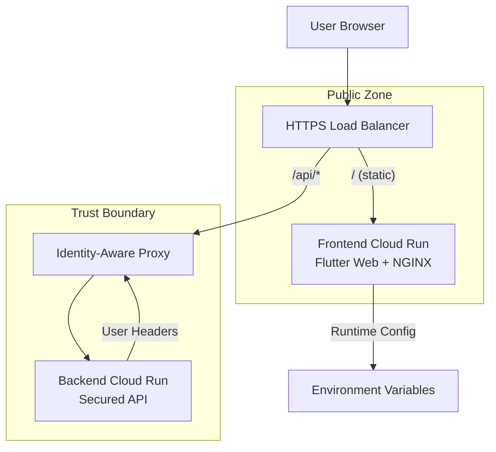
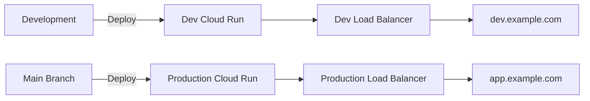

# Architecture Overview

## System Architecture

The Dynamic Persona Frontend is part of a secure, scalable architecture designed for production deployment on Google Cloud Platform.

## Data Flow

### 1. Initial Page Load
1. User navigates to application URL
2. Load Balancer routes to Frontend Cloud Run service
3. NGINX serves Flutter web application
4. Browser loads `/config/runtime-env.js` with environment-based configuration
5. Flutter app initializes with runtime configuration

### 2. API Communication
1. User interacts with chat interface
2. Flutter app makes HTTP request to `/api/*` endpoint
3. Load Balancer routes `/api/*` requests to IAP
4. IAP validates user authentication:
   - If authenticated: forwards request with user headers
   - If not authenticated: redirects to Google OAuth flow
5. Backend receives request with authenticated user information
6. Backend processes request and returns response
7. Flutter app displays response to user

### 3. Authentication Flow (IAP)
1. User attempts to access `/api/*` endpoint
2. IAP checks for valid authentication cookie
3. If no valid cookie: redirect to Google OAuth
4. User completes OAuth flow with Google
5. IAP sets authentication cookie
6. Subsequent `/api/*` requests include authentication context

## Component Details

### Frontend Service (Public)
- **Purpose**: Serve Flutter web SPA to users
- **Technology**: Flutter Web + NGINX on Cloud Run
- **Security**: Public access, no authentication required
- **Configuration**: Runtime environment injection via JavaScript

#### Key Features:
- SPA routing with fallback to `index.html`
- Static asset caching with cache-busting for updates
- Runtime configuration injection (no rebuild required)
- Health check endpoint for load balancer monitoring

### Backend Service (Secured)
- **Purpose**: Process API requests with authenticated user context
- **Technology**: Cloud Run service behind IAP
- **Security**: Google Cloud IAP authentication required
- **Access Control**: IAM-based user/group permissions

#### IAP Integration:
- Receives user identity via HTTP headers:
  - `X-Goog-Authenticated-User-Email`
  - `X-Goog-Authenticated-User-Id`
  - `X-Goog-IAP-JWT-Assertion`

### Load Balancer Configuration
- **URL Mapping**:
  - `/` → Frontend Service (public)
  - `/api/*` → Backend Service (IAP-protected)
- **SSL/TLS**: Managed certificates for HTTPS
- **Health Checks**: Monitor service availability

## Security Model

### Trust Boundaries

1. **Public Zone**: 
   - Frontend application (no sensitive data)
   - Load balancer (routing only)

2. **Authenticated Zone**:
   - IAP (identity verification)
   - Backend services (trusted user context)

### Security Principles

1. **No Secrets in Frontend**: All sensitive configuration and data remains on backend
2. **Cookie-Based Authentication**: IAP manages authentication state via HTTP cookies
3. **Header-Based Identity**: Backend trusts IAP-injected user headers
4. **Same-Origin Requests**: Frontend uses relative `/api/*` URLs to avoid CORS complexity

### Authentication Benefits

- **Simplified Frontend**: No token management required
- **Centralized Access Control**: IAM-based permissions
- **Session Management**: Handled entirely by Google Cloud IAP
- **Security Headers**: Automatic injection of user identity

## Deployment Architecture

### Environment Separation

### Configuration Management
- **Environment Variables**: Different values per environment
- **Runtime Injection**: No rebuilds required for configuration changes
- **Secret Management**: Sensitive data managed via Google Secret Manager (backend only)

## Network Flow

### Frontend → Backend Communication
1. Browser makes XHR/Fetch request to `/api/endpoint`
2. Request includes IAP authentication cookie (automatic)
3. Load balancer routes to IAP
4. IAP validates cookie and forwards with user headers
5. Backend processes authenticated request
6. Response flows back through same path

### Benefits of This Architecture
- **CORS Avoidance**: Same-origin requests eliminate CORS complexity
- **Session Continuity**: IAP cookies persist across browser sessions
- **Scalability**: Both frontend and backend auto-scale on Cloud Run
- **Security**: Clear separation between public and authenticated zones

## Monitoring and Observability

### Health Checks
- Frontend: `/health` endpoint
- Backend: IAP-protected health endpoint
- Load Balancer: Automatic health monitoring

### Logging
- **Frontend**: NGINX access logs, JavaScript console logs
- **Backend**: Structured application logs with user context
- **IAP**: Authentication and authorization events

### Metrics
- Request latency and throughput
- Error rates by service
- Authentication success/failure rates
- Resource utilization (CPU, memory)

## Scaling Considerations

### Automatic Scaling
- **Cloud Run**: Scales to zero when not in use
- **Load Balancer**: Handles traffic distribution
- **IAP**: Scales automatically with Google infrastructure

### Performance Optimization
- **CDN**: Static assets served with long cache times
- **Compression**: GZIP enabled for text content
- **Image Optimization**: Optimized Flutter web builds
- **Code Splitting**: Flutter's automatic code splitting for faster loads

## Disaster Recovery

### Backup Strategy
- **Source Code**: Git repository with multiple remotes
- **Configuration**: Infrastructure as Code (Terraform/Cloud Build)
- **Data**: Backend data backup strategy (separate from frontend)

### Failover
- **Multi-Region**: Deploy to multiple Cloud Run regions
- **Health Monitoring**: Automatic failover via Load Balancer
- **Rollback**: Cloud Run revision management for quick rollbacks
