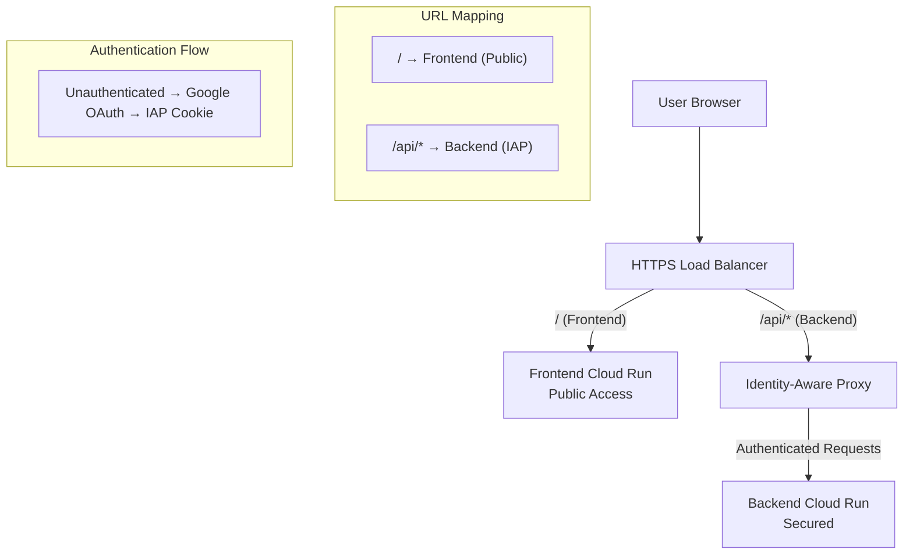

# Identity-Aware Proxy (IAP) Setup Guide

This guide provides step-by-step instructions for setting up Google Cloud Identity-Aware Proxy (IAP) to secure your Dynamic Persona Frontend backend while keeping the frontend publicly accessible.

## Architecture Overview



## Prerequisites

### Required APIs
```bash
# Enable necessary Google Cloud APIs
gcloud services enable compute.googleapis.com
gcloud services enable run.googleapis.com
gcloud services enable iap.googleapis.com
gcloud services enable cloudresourcemanager.googleapis.com
```

### Required Permissions
Your account needs these IAM roles:
- `Compute Network Admin`
- `Cloud Run Admin`
- `IAP Admin`
- `Security Admin`

## Step 1: Deploy Backend Service (IAP-Protected)

### Deploy Backend Cloud Run Service
```bash
# Deploy backend service (replace with your actual backend)
gcloud run deploy dynamic-persona-backend \
  --image gcr.io/YOUR_PROJECT_ID/backend:latest \
  --platform managed \
  --region us-central1 \
  --no-allow-unauthenticated \
  --port 8080 \
  --memory 1Gi \
  --cpu 1
```

**Important**: Use `--no-allow-unauthenticated` to ensure the backend is not publicly accessible.

### Get Backend Service URL
```bash
# Get the backend service URL (needed for Load Balancer configuration)
BACKEND_URL=$(gcloud run services describe dynamic-persona-backend \
  --region us-central1 \
  --format="value(status.url)")

echo "Backend URL: $BACKEND_URL"
```

## Step 2: Create External HTTPS Load Balancer

### Create Health Check
```bash
# Create health check for backend
gcloud compute health-checks create http backend-health-check \
  --port 8080 \
  --request-path /health \
  --check-interval 30s \
  --timeout 10s \
  --healthy-threshold 2 \
  --unhealthy-threshold 3

# Create health check for frontend
gcloud compute health-checks create http frontend-health-check \
  --port 8080 \
  --request-path /health \
  --check-interval 30s \
  --timeout 10s \
  --healthy-threshold 2 \
  --unhealthy-threshold 3
```

### Create Backend Services
```bash
# Create backend service for the backend API (will be IAP-protected)
gcloud compute backend-services create dynamic-persona-backend-service \
  --protocol HTTP \
  --health-checks backend-health-check \
  --global

# Create backend service for the frontend
gcloud compute backend-services create dynamic-persona-frontend-service \
  --protocol HTTP \
  --health-checks frontend-health-check \
  --global
```

### Create Network Endpoint Groups (NEGs)
```bash
# Create NEG for backend Cloud Run service
gcloud compute network-endpoint-groups create dynamic-persona-backend-neg \
  --region us-central1 \
  --network-endpoint-type serverless \
  --cloud-run-service dynamic-persona-backend

# Create NEG for frontend Cloud Run service
gcloud compute network-endpoint-groups create dynamic-persona-frontend-neg \
  --region us-central1 \
  --network-endpoint-type serverless \
  --cloud-run-service dynamic-persona-frontend
```

### Add NEGs to Backend Services
```bash
# Add backend NEG to backend service
gcloud compute backend-services add-backend dynamic-persona-backend-service \
  --global \
  --network-endpoint-group dynamic-persona-backend-neg \
  --network-endpoint-group-region us-central1

# Add frontend NEG to frontend service
gcloud compute backend-services add-backend dynamic-persona-frontend-service \
  --global \
  --network-endpoint-group dynamic-persona-frontend-neg \
  --network-endpoint-group-region us-central1
```

### Create URL Map
```bash
# Create URL map with path-based routing
gcloud compute url-maps create dynamic-persona-url-map \
  --default-service dynamic-persona-frontend-service

# Add path matcher for API endpoints
gcloud compute url-maps add-path-matcher dynamic-persona-url-map \
  --path-matcher-name api-matcher \
  --default-service dynamic-persona-frontend-service \
  --path-rules "/api/*=dynamic-persona-backend-service"
```

### Create SSL Certificate
```bash
# Create managed SSL certificate (replace with your domain)
gcloud compute ssl-certificates create dynamic-persona-ssl-cert \
  --domains app.example.com \
  --global

# Alternative: Upload your own certificate
# gcloud compute ssl-certificates create dynamic-persona-ssl-cert \
#   --certificate certificate.crt \
#   --private-key private.key \
#   --global
```

### Create HTTPS Proxy
```bash
# Create target HTTPS proxy
gcloud compute target-https-proxies create dynamic-persona-https-proxy \
  --url-map dynamic-persona-url-map \
  --ssl-certificates dynamic-persona-ssl-cert
```

### Create Global Forwarding Rule
```bash
# Reserve static IP address
gcloud compute addresses create dynamic-persona-ip --global

# Get the reserved IP address
STATIC_IP=$(gcloud compute addresses describe dynamic-persona-ip \
  --global \
  --format="value(address)")

echo "Static IP: $STATIC_IP"

# Create forwarding rule
gcloud compute forwarding-rules create dynamic-persona-https-forwarding-rule \
  --address dynamic-persona-ip \
  --global \
  --target-https-proxy dynamic-persona-https-proxy \
  --ports 443
```

## Step 3: Configure Identity-Aware Proxy (IAP)

### Enable IAP on Backend Service
```bash
# Enable IAP on the backend service
gcloud iap web enable --resource-type backend-services \
  --service dynamic-persona-backend-service
```

### Configure OAuth Consent Screen
```bash
# Create OAuth brand (if not exists)
gcloud iap oauth-brands create \
  --application_title "Dynamic Persona Application" \
  --support_email YOUR_EMAIL@example.com

# List OAuth brands to get the brand name
gcloud iap oauth-brands list
```

### Create OAuth Client
```bash
# Create OAuth client for IAP
gcloud iap oauth-clients create BRAND_NAME \
  --display_name "Dynamic Persona IAP Client"

# List OAuth clients to get client ID
gcloud iap oauth-clients list BRAND_NAME
```

### Configure IAP Settings
```bash
# Set access policy for IAP (replace with your email/group)
gcloud projects add-iam-policy-binding YOUR_PROJECT_ID \
  --member user:your-email@example.com \
  --role roles/iap.httpsResourceAccessor

# Or grant access to a Google Group
gcloud projects add-iam-policy-binding YOUR_PROJECT_ID \
  --member group:your-team@example.com \
  --role roles/iap.httpsResourceAccessor
```

## Step 4: DNS Configuration

### Configure DNS Records
Add the following DNS records with your domain provider:

```dns
# A record pointing to the static IP
app.example.com.    A    YOUR_STATIC_IP

# Alternative: CNAME record (if using subdomain)
app.example.com.    CNAME    ghs.googlehosted.com.
```

### Verify DNS Configuration
```bash
# Test DNS resolution
nslookup app.example.com

# Test with dig
dig app.example.com
```

## Step 5: Update Frontend Configuration

### Update Frontend Environment Variables
```bash
# Update frontend to use the Load Balancer URL
gcloud run services update dynamic-persona-frontend \
  --region us-central1 \
  --update-env-vars BACKEND_BASE_URL=/api,IAP_MODE=true
```

### Get IAP Audience (if needed)
```bash
# Get the IAP audience for the backend service
IAP_AUDIENCE=$(gcloud iap web get-iam-policy \
  --resource-type backend-services \
  --service dynamic-persona-backend-service \
  --format="value(bindings[0].members[0])" | cut -d'/' -f4)

echo "IAP Audience: $IAP_AUDIENCE"

# Update frontend with IAP audience (if your backend requires it)
gcloud run services update dynamic-persona-frontend \
  --region us-central1 \
  --update-env-vars IAP_AUDIENCE=$IAP_AUDIENCE
```

## Step 6: Verification and Testing

### Test Public Frontend Access
```bash
# Test frontend accessibility (should work without authentication)
curl -I https://app.example.com
# Expected: 200 OK

curl -I https://app.example.com/health
# Expected: 200 OK
```

### Test IAP-Protected Backend
```bash
# Test backend without authentication (should redirect to Google OAuth)
curl -I https://app.example.com/api/health
# Expected: 302 redirect to accounts.google.com

# Test with browser (should prompt for Google login)
open https://app.example.com/api/health
```

### Verify IAP Headers in Backend
After successful authentication, your backend should receive these headers:

```
X-Goog-Authenticated-User-Email: user@example.com
X-Goog-Authenticated-User-Id: 1234567890
X-Goog-IAP-JWT-Assertion: eyJhbGciOiJFUzI1NiIsInR5cCI6IkpXVCJ9...
```

Example backend verification code:
```python
# Python Flask example
from flask import request

@app.route('/api/profile')
def get_profile():
    user_email = request.headers.get('X-Goog-Authenticated-User-Email')
    user_id = request.headers.get('X-Goog-Authenticated-User-Id')
    
    if not user_email:
        return {'error': 'No authenticated user'}, 401
    
    return {
        'email': user_email.replace('accounts.google.com:', ''),
        'id': user_id.replace('accounts.google.com:', '')
    }
```

## Step 7: Advanced Configuration

### Custom Access Control
```bash
# Create custom IAM role for specific access
gcloud iam roles create dynamicPersonaUser \
  --project YOUR_PROJECT_ID \
  --title "Dynamic Persona User" \
  --description "Access to Dynamic Persona application" \
  --permissions iap.httpsResourceAccessor

# Grant custom role to users
gcloud projects add-iam-policy-binding YOUR_PROJECT_ID \
  --member user:specific-user@example.com \
  --role projects/YOUR_PROJECT_ID/roles/dynamicPersonaUser
```

### Organization-Level Access
```bash
# Grant access to entire organization domain
gcloud projects add-iam-policy-binding YOUR_PROJECT_ID \
  --member domain:example.com \
  --role roles/iap.httpsResourceAccessor
```

### Time-Limited Access
```bash
# Grant temporary access with expiration
gcloud projects add-iam-policy-binding YOUR_PROJECT_ID \
  --member user:contractor@example.com \
  --role roles/iap.httpsResourceAccessor \
  --condition='expression=request.time < timestamp("2024-12-31T23:59:59Z"),title=Temporary Access,description=Access expires end of year'
```

## Monitoring and Troubleshooting

### Monitor IAP Access Logs
```bash
# View IAP access logs
gcloud logging read "resource.type=gce_backend_service AND resource.labels.backend_service_name=dynamic-persona-backend-service" \
  --limit 50 \
  --format json

# View authentication events
gcloud logging read "protoPayload.serviceName=iap.googleapis.com" \
  --limit 50
```

### Common Issues and Solutions

#### Issue: 403 Forbidden after OAuth
**Cause**: User doesn't have IAP access permissions
**Solution**:
```bash
# Grant IAP access to the user
gcloud projects add-iam-policy-binding YOUR_PROJECT_ID \
  --member user:user@example.com \
  --role roles/iap.httpsResourceAccessor
```

#### Issue: SSL Certificate Not Ready
**Cause**: Managed certificate provisioning takes time
**Solution**:
```bash
# Check certificate status
gcloud compute ssl-certificates describe dynamic-persona-ssl-cert \
  --global \
  --format="value(managed.status)"

# Wait for ACTIVE status (can take 15-60 minutes)
```

#### Issue: Backend Service Unhealthy
**Cause**: Health check failing
**Solution**:
```bash
# Check health check status
gcloud compute backend-services get-health dynamic-persona-backend-service \
  --global

# Verify backend service has /health endpoint
curl https://BACKEND_CLOUD_RUN_URL/health
```

#### Issue: CORS Errors
**Cause**: Cross-origin requests not properly configured
**Solution**: Use same-origin `/api/*` routing (already configured in this guide)

### Debug Commands

```bash
# Check URL map configuration
gcloud compute url-maps describe dynamic-persona-url-map

# Check backend service health
gcloud compute backend-services get-health dynamic-persona-backend-service --global

# Check IAP settings
gcloud iap web get-iam-policy \
  --resource-type backend-services \
  --service dynamic-persona-backend-service

# Test with curl (follow redirects)
curl -L -v https://app.example.com/api/health

# Check SSL certificate status
gcloud compute ssl-certificates describe dynamic-persona-ssl-cert --global
```

## Security Best Practices

### IAP Security Configuration
1. **Least Privilege**: Grant minimal required access
2. **Group Management**: Use Google Groups for team access
3. **Regular Audits**: Review IAP access permissions regularly
4. **JWT Validation**: Always validate IAP JWT assertions in backend
5. **Session Management**: Configure appropriate session timeouts

### Network Security
1. **Private Backend**: Ensure backend Cloud Run service is not publicly accessible
2. **Health Checks**: Use specific health check endpoints
3. **HTTPS Only**: Force HTTPS redirection
4. **Security Headers**: Configure appropriate security headers

### Monitoring and Alerting
1. **Access Monitoring**: Monitor who accesses the application
2. **Failed Authentication**: Alert on authentication failures
3. **Backend Health**: Monitor backend service health
4. **Certificate Expiry**: Monitor SSL certificate expiration

## Cost Optimization

### Load Balancer Optimization
```bash
# Use regional load balancer for single region (if applicable)
# Note: IAP requires global load balancer

# Optimize health check intervals
gcloud compute health-checks update http backend-health-check \
  --check-interval 60s \
  --timeout 30s
```

### Cloud Run Optimization
```bash
# Set minimum instances to reduce cold starts (if needed)
gcloud run services update dynamic-persona-backend \
  --region us-central1 \
  --min-instances 0 \
  --max-instances 10

# Optimize resource allocation
gcloud run services update dynamic-persona-backend \
  --region us-central1 \
  --memory 512Mi \
  --cpu 1
```

## Backup and Disaster Recovery

### Configuration Backup
```bash
# Export URL map configuration
gcloud compute url-maps describe dynamic-persona-url-map \
  --format="export" > url-map-backup.yaml

# Export backend service configuration
gcloud compute backend-services describe dynamic-persona-backend-service \
  --global \
  --format="export" > backend-service-backup.yaml

# Export IAP configuration
gcloud iap web get-iam-policy \
  --resource-type backend-services \
  --service dynamic-persona-backend-service \
  --format="export" > iap-policy-backup.yaml
```

### Restore Procedures
```bash
# Restore URL map
gcloud compute url-maps create dynamic-persona-url-map-restore \
  --source url-map-backup.yaml

# Restore backend service
gcloud compute backend-services create dynamic-persona-backend-service-restore \
  --source backend-service-backup.yaml \
  --global

# Restore IAP policy
gcloud iap web set-iam-policy \
  --resource-type backend-services \
  --service dynamic-persona-backend-service-restore \
  iap-policy-backup.yaml
```

This completes the IAP setup guide. Your Dynamic Persona Frontend should now be publicly accessible while the backend API is protected by Google Cloud IAP, providing secure authentication through Google accounts.
